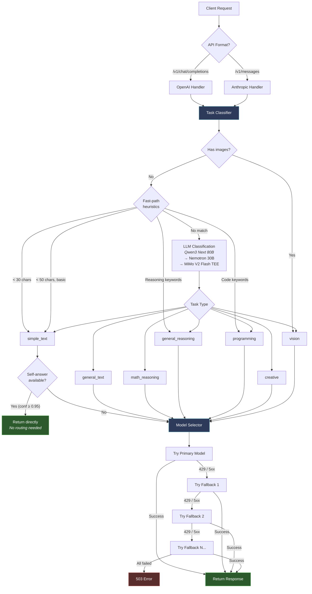

# Model Router

Intelligent LLM request router that classifies incoming requests and routes them to the optimal model based on task type.

## How It Works

1. A classifier (**Qwen3 Next 80B**, with Nemotron and MiMo V2 Flash TEE fallbacks) analyzes incoming requests
2. Requests are categorized into task types: simple text, general, math reasoning, general reasoning, programming, creative, vision
3. Each task type routes to the best-suited model with automatic fallback on failure
4. **Self-answer optimization**: For trivially simple questions (greetings, basic facts), the classifier answers directly — saving a round-trip to a second model
5. **Universal fallback**: Kimi K2.5 serves as the last-resort fallback for all task types
6. Supports both **OpenAI Chat Completions** (`/v1/chat/completions`) and **Anthropic Messages** (`/v1/messages`) API formats

## Model Routing Table

| Task Type | Primary Model | Fallbacks |
|-----------|---------------|-----------|
| Simple Text | MiMo V2 Flash | Kimi K2.5 |
| General | Qwen3 Next 80B | Nemotron 3 Nano 30B, MiMo V2 Flash TEE, Kimi K2.5 |
| Math/Reasoning | DeepSeek V3.2 Speciale | Kimi K2.5 |
| General Reasoning | Kimi K2.5 | GLM 5, MiniMax M2.5 |
| Programming | MiniMax M2.5 | GLM 5, MiniMax M2.1, DeepSeek V3.2, Qwen3 235B |
| Creative | TNG R1T2 Chimera | Kimi K2.5 |
| Vision | Qwen3.5 397B | Kimi K2.5, Qwen3 VL 235B, Mistral Small 3.2 |

### Classifier Models

| Priority | Model | Role |
|----------|-------|------|
| Primary | Qwen3 Next 80B | Task classification + self-answer |
| Fallback 1 | Nemotron 3 Nano 30B | Classification only |
| Fallback 2 | MiMo V2 Flash TEE | Classification only |

## API Endpoints

| Method | Path | Description |
|--------|------|-------------|
| GET | `/health` | Health check |
| GET | `/v1/models` | List available models |
| GET | `/v1/router/metrics` | Routing metrics |
| POST | `/v1/chat/completions` | OpenAI-compatible chat completions |
| POST | `/v1/messages` | Anthropic Messages API |

## Authentication

All inference endpoints require an API key via `Authorization: Bearer <key>` or `x-api-key: <key>` header.

The router accepts keys matching either `CHUTES_API_KEY` or `ROUTER_API_KEY` environment variables.

## Environment Variables

| Variable | Required | Description |
|----------|----------|-------------|
| `CHUTES_API_KEY` | Yes | API key for upstream LLM provider (Chutes) |
| `UPSTREAM_API_BASE` | No | Override upstream API URL (default: `https://llm.chutes.ai/v1`) |
| `ROUTER_API_KEY` | No | Separate key for caller authentication (defaults to `CHUTES_API_KEY`) |

## Local Development

```bash
# Install dependencies
pip install -r requirements.txt

# Set your API key
export CHUTES_API_KEY="your-key"

# Run locally
uvicorn model_router.server:app --host 0.0.0.0 --port 8000
```

## Deployment

### Vercel (current)

Deployed to the **chutesai** Vercel team.

```bash
# Deploy to production
cd model-router
vercel --prod
```

The Vercel deployment uses `api/index.py` as the serverless entrypoint. Set `CHUTES_API_KEY` in the Vercel project environment variables.

### Docker / Self-hosted

```bash
pip install -r requirements.txt
uvicorn model_router.server:app --host 0.0.0.0 --port 8000
```

## Usage Examples

### OpenAI SDK

```python
from openai import OpenAI

client = OpenAI(
    base_url="https://model-router-ten.vercel.app/v1",
    api_key="your-chutes-api-key"
)

response = client.chat.completions.create(
    model="model-router",
    messages=[{"role": "user", "content": "Write a quicksort in Python"}]
)
```

### Anthropic SDK

```python
import anthropic

client = anthropic.Anthropic(
    base_url="https://model-router-ten.vercel.app",
    api_key="your-chutes-api-key"
)

message = client.messages.create(
    model="model-router",
    max_tokens=4096,
    messages=[{"role": "user", "content": "What's in this image?"}]
)
```

## Projects Using This Router

| Project | How It Uses the Router |
|---------|----------------------|
| [OpenClaw](../openclaw-as-a-service/README.md) | Primary LLM provider for inference proxy |
| [Janus PoC](../janus-poc/README.md) | Both baselines embed a local copy of this router for task-based model selection |
| [Agent-as-a-Service Web](../agent-as-a-service-web/README.md) | Ops console uses the Vercel deployment for agent sandbox runs |
| [Sandy](../sandy/README.md) | Ships an embedded copy at `/router` (janus_router); standalone version supersedes it |

## Architecture



## Decision Graph & Fallback Chains

Each task type has a dedicated primary model and ordered fallback chain. On upstream failure (429/5xx), models are tried left-to-right. **Kimi K2.5** serves as universal last-resort for all non-vision types.

```mermaid
flowchart LR
    subgraph simple["Simple Text"]
        S1["MiMo V2 Flash"] --> S2["Kimi K2.5"]
    end
    subgraph general["General"]
        G1["Qwen3 Next 80B"] --> G2["Nemotron 30B"] --> G3["MiMo V2 Flash TEE"] --> G4["Kimi K2.5"]
    end
    subgraph math["Math Reasoning"]
        M1["DeepSeek V3.2 Speciale"] --> M2["Kimi K2.5"]
    end
    subgraph genreason["General Reasoning"]
        GR1["Kimi K2.5"] --> GR2["GLM 5"] --> GR3["MiniMax M2.5"]
    end
    subgraph prog["Programming"]
        P1["MiniMax M2.5"] --> P2["GLM 5"] --> P3["MiniMax M2.1"] --> P4["DeepSeek V3.2"] --> P5["Qwen3 235B"]
    end
    subgraph creative["Creative"]
        C1["TNG R1T2 Chimera"] --> C2["Kimi K2.5"]
    end
    subgraph vision["Vision"]
        V1["Qwen3.5 397B"] --> V2["Kimi K2.5"] --> V3["Qwen3 VL 235B"] --> V4["Mistral Small 3.2"]
    end

    style S1 fill:#1a3a1a,stroke:#4a4,color:#fff
    style G1 fill:#1a3a1a,stroke:#4a4,color:#fff
    style M1 fill:#1a3a1a,stroke:#4a4,color:#fff
    style GR1 fill:#1a3a1a,stroke:#4a4,color:#fff
    style P1 fill:#1a3a1a,stroke:#4a4,color:#fff
    style C1 fill:#1a3a1a,stroke:#4a4,color:#fff
    style V1 fill:#1a3a1a,stroke:#4a4,color:#fff
```



**Classifier chain**: Qwen3 Next 80B → Nemotron 3 Nano 30B → MiMo V2 Flash TEE (used for classification only; not part of routing).
