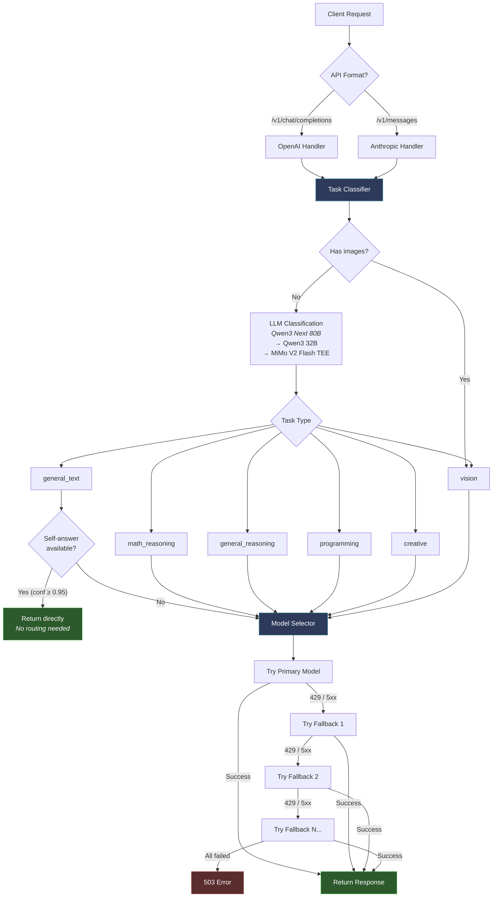

# Model Router

Intelligent LLM request router that classifies incoming requests and routes them to the optimal model based on task type.

## How It Works

1. A classifier (**Qwen3 Next 80B**, with Qwen3 32B and MiMo V2 Flash TEE fallbacks) analyzes incoming requests
2. Requests are categorized into task types: general, math reasoning, general reasoning, programming, creative, vision
3. Each task type routes to the best-suited model with automatic fallback on failure
4. **Self-answer optimization**: For trivially simple questions (greetings, basic facts), the classifier answers directly — saving a round-trip to a second model
5. **Universal fallback**: Kimi K2.6 serves as the last-resort fallback for all task types (with Kimi K2.5 as a secondary legacy fallback)
6. Supports both **OpenAI Chat Completions** (`/v1/chat/completions`) and **Anthropic Messages** (`/v1/messages`) API formats

## Model Routing Table

| Task Type | Primary Model | Fallbacks |
|-----------|---------------|-----------|
| General | Kimi K2.6 | MiMo V2 Flash TEE, Qwen3 Next 80B, Kimi K2.5 |
| Math Reasoning | Kimi K2.6 | GLM 5.1, Kimi K2.5 |
| General Reasoning | Kimi K2.6 | GLM 5.1, MiniMax M2.5, Kimi K2.5 |
| Programming | GLM 5.1 | Kimi K2.6, MiniMax M2.5, Kimi K2.5 |
| Creative | Kimi K2.6 | TNG R1T2 Chimera, Kimi K2.5 |
| Vision | Kimi K2.6 | Qwen3.6 27B, Gemma 4 31B Turbo, Kimi K2.5 |

### Classifier Models

| Priority | Model | Role |
|----------|-------|------|
| Primary | Qwen3 Next 80B | Task classification + self-answer |
| Fallback 1 | Qwen3.6 27B | Classification only |
| Fallback 2 | Gemma 4 31B Turbo TEE | Classification only |
| Fallback 3 | MiMo V2 Flash TEE | Classification only |

## API Endpoints

| Method | Path | Description |
|--------|------|-------------|
| GET | `/health` | Health check |
| GET | `/v1/models` | List available models |
| GET | `/v1/router/metrics` | Routing metrics |
| POST | `/v1/chat/completions` | OpenAI-compatible chat completions |
| POST | `/v1/messages` | Anthropic Messages API |

## Authentication

All inference endpoints require an API key via `Authorization: Bearer <key>` or `x-api-key: <key>` header.

The router accepts keys matching either `CHUTES_API_KEY` or `ROUTER_API_KEY` environment variables.

## Environment Variables

| Variable | Required | Description |
|----------|----------|-------------|
| `CHUTES_API_KEY` | Yes | API key for upstream LLM provider (Chutes) |
| `UPSTREAM_API_BASE` | No | Override upstream API URL (default: `https://llm.chutes.ai/v1`) |
| `ROUTER_API_KEY` | No | Separate key for caller authentication (defaults to `CHUTES_API_KEY`) |

## Local Development

```bash
# Install dependencies
pip install -r requirements.txt

# Set your API key
export CHUTES_API_KEY="your-key"

# Run locally
uvicorn model_router.server:app --host 0.0.0.0 --port 8000
```

## Deployment

### Vercel (current)

Deployed to the **chutesai** Vercel team.

```bash
# Deploy to production
cd model-router
vercel --prod
```

The Vercel deployment uses `api/index.py` as the serverless entrypoint. Set `CHUTES_API_KEY` in the Vercel project environment variables.

### Docker / Self-hosted

```bash
pip install -r requirements.txt
uvicorn model_router.server:app --host 0.0.0.0 --port 8000
```

## Usage Examples

### OpenAI SDK

```python
from openai import OpenAI

client = OpenAI(
    base_url="https://model-router-ten.vercel.app/v1",
    api_key="your-chutes-api-key"
)

response = client.chat.completions.create(
    model="model-router",
    messages=[{"role": "user", "content": "Write a quicksort in Python"}]
)
```

### Anthropic SDK

```python
import anthropic

client = anthropic.Anthropic(
    base_url="https://model-router-ten.vercel.app",
    api_key="your-chutes-api-key"
)

message = client.messages.create(
    model="model-router",
    max_tokens=4096,
    messages=[{"role": "user", "content": "What's in this image?"}]
)
```

## Architecture



## Decision Graph & Fallback Chains

Each task type has a dedicated primary model and ordered fallback chain. On upstream failure (429/5xx), models are tried left-to-right. **Kimi K2.6** serves as universal last-resort for all task types (with Kimi K2.5 retained as a secondary legacy fallback).

```mermaid
flowchart LR
    subgraph general["General"]
        G1["Kimi K2.6"] --> G2["MiMo V2 Flash TEE"] --> G3["Qwen3 Next 80B"] --> G4["Kimi K2.5"]
    end
    subgraph math["Math Reasoning"]
        M1["Kimi K2.6"] --> M2["GLM 5.1"] --> M3["Kimi K2.5"]
    end
    subgraph genreason["General Reasoning"]
        GR1["Kimi K2.6"] --> GR2["GLM 5.1"] --> GR3["MiniMax M2.5"] --> GR4["Kimi K2.5"]
    end
    subgraph prog["Programming"]
        P1["GLM 5.1"] --> P2["Kimi K2.6"] --> P3["MiniMax M2.5"] --> P4["Kimi K2.5"]
    end
    subgraph creative["Creative"]
        C1["Kimi K2.6"] --> C2["TNG R1T2 Chimera"] --> C3["Kimi K2.5"]
    end
    subgraph vision["Vision"]
        V1["Kimi K2.6"] --> V2["Qwen3.6 27B"] --> V3["Gemma 4 31B Turbo"] --> V4["Kimi K2.5"]
    end

    style G1 fill:#1a3a1a,stroke:#4a4,color:#fff
    style M1 fill:#1a3a1a,stroke:#4a4,color:#fff
    style GR1 fill:#1a3a1a,stroke:#4a4,color:#fff
    style P1 fill:#1a3a1a,stroke:#4a4,color:#fff
    style C1 fill:#1a3a1a,stroke:#4a4,color:#fff
    style V1 fill:#1a3a1a,stroke:#4a4,color:#fff
```



**Classifier chain**: Qwen3 Next 80B → Qwen3.6 27B → Gemma 4 31B Turbo TEE → MiMo V2 Flash TEE (used for classification only; not part of routing).

## max_tokens & capacity

### Why we send a generous `max_tokens`

All chat-tier `ModelConfig` entries default to `DEFAULT_CHAT_MAX_TOKENS = 65_535`, which sits just under the smallest output limit among the models we route to. The router uses this as a backstop only — `request.max_tokens` from the caller wins when present (callers like `chutes-frontend` set `65_535` explicitly).

This matters because our primary models — **Kimi K2.6**, **DeepSeek R1**, **Qwen3-235B-Thinking**, and others — are reasoning models. Their response stream looks like:

```
delta.reasoning_content: " The user wants ..."   ← consumed first, off-screen
delta.reasoning_content: " So the answer is ..."
delta.content: "The square root of 144 is 12."   ← only what the user sees
```

The reasoning portion still spends tokens against the budget. With a tight cap (the historic 4-8k defaults) a reasoning model can burn the entire budget on `reasoning_content` before any `content` is produced — the upstream then returns `content: null` with `finish_reason: "length"`. That shape is indistinguishable from "model produced nothing", which the non-streaming empty-detection path treats as a failure and falls through to the next candidate. The result: K2.6 looks broken even though it was just thinking.

A 65k cap gives reasoning models comfortable headroom and isn't a hard ceiling on cost — most assistant turns finish well below it (`finish_reason: "stop"` long before token exhaustion). Models with output limits *below* 65k clamp the value server-side and respond normally; verified against `Kimi-K2.6-TEE` and `gemma-4-31B-turbo-TEE` at `max_tokens=200_000` (both returned 200 / `finish_reason: stop`).

### What "empty response" means by case

| `content` | `tool_calls` | `finish_reason` | router's verdict |
|-----------|--------------|-----------------|------------------|
| `null` | populated | (any) | **Not empty** — model chose to call a tool. Pass through. |
| `null` | `[]` | `length` | Empty *for this budget*. Falling back is reasonable; the next model may fit a complete answer. |
| `null` | `[]` | `stop` | Genuinely empty. Falling back is correct. |
| non-empty | (any) | (any) | Not empty. Pass through. |

The streaming path (`_chunk_has_useful_output`) already counts `reasoning_content` as a useful chunk, so reasoning streams aren't classified as empty mid-flight. The non-streaming path doesn't have the same shortcut and relies on the final `content` field — bumping `max_tokens` is the cheapest way to make that path happy with reasoning models too.

### Capacity-driven fallback is intentional

When K2.6 is at upstream capacity (429 / "infrastructure at maximum capacity" / 5xx), the router demotes the request to the next model in the task chain rather than serving the user a 503. This is a feature, not a bug: an answer from MiMo V2 Flash or Qwen3-Next is strictly better than no answer. The frontend's response header (`X-Router-Model`) reports whichever model actually produced the answer so callers can persist the truth. If you see disproportionate non-K2.6 usage in the DB, the upstream chute health is the most likely cause — check `/v1/router/metrics`'s `errors_by_model` and `requests_by_model` for the smoking gun.
